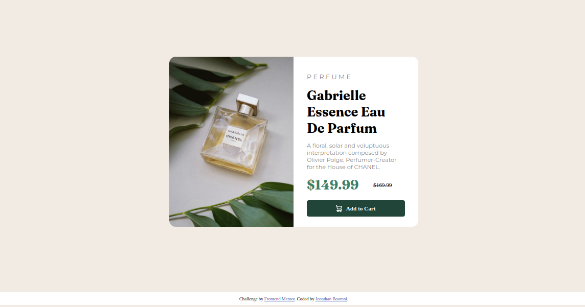

# Frontend Mentor - Product preview card component solution

This is my solution to the [Product preview card component challenge on Frontend Mentor]((https://www.frontendmentor.io/challenges/product-preview-card-component-GO7UmttRfa). The challenge is to build a product preview card that is responsive and has hover and focus states.

## Table of contents

- [Overview](#overview)
  - [The challenge](#the-challenge)
  - [Screenshot](#screenshot)
  - [Links](#links)
- [My process](#my-process)
  - [Built with](#built-with)
- [Author](#author)

## Overview
The product preview card component is a responsive card that shows the details of a product. It has a main image, product information, and a section to highlight the product's features. The challenge is to build this card and make it responsive, so that it looks good on different devices, and to add hover and focus states for interactive elements.

### The challenge

Users should be able to:

- View the optimal layout depending on their device's screen size
- See hover and focus states for interactive elements

### Screenshot

### Links

- Live Site URL: [Live Site](https://lively-cocada-1ee5e0.netlify.app/)

## My process

### Built with

- Semantic HTML5 markup
- CSS custom properties
- Flexbox

## Author

- Website - [Jonathan Boomni](https://boomni.tech)
- Frontend Mentor - [@Boomni](https://www.frontendmentor.io/profile/Boomni)
- Twitter - [Jonathan Boomni](https://www.twitter.com/rejoiceoye1)
